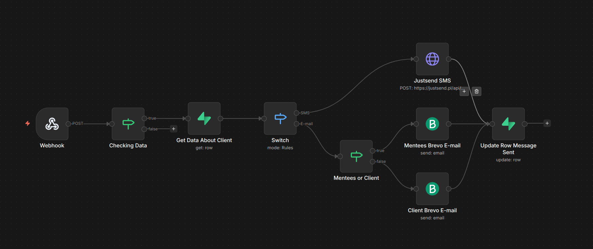
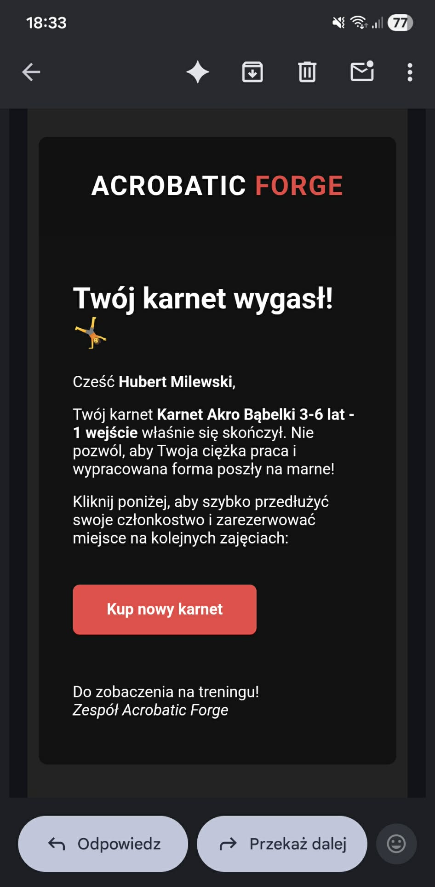
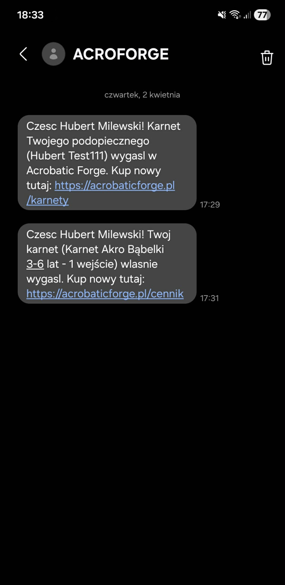

# Automated Membership Retention System For Acrobatic Forge

### Overview
This project is a production-ready automation system built for **Acrobatic Forge**, an acrobatics club. It automatically detects expired memberships in a Supabase database and triggers personalized recovery communications via Email and SMS. It eliminates manual auditing, saves hours of administrative work, and significantly increases member retention.

---

### Tech Stack
* **n8n** (Self-hosted) - Core workflow orchestration and logic.
* **Supabase (PostgreSQL)** - Real-time database and webhook triggers.
* **Brevo (API)** - Professional HTML transactional email delivery.
* **JustSend (API)** - Dynamic SMS delivery with custom sender ID and GSM optimization.
* **Cloudflare Tunnel** - Secure connectivity for the self-hosted n8n instance.

---

### Key Engineering Features

#### 1. "Anti-Spam" State Management
Implemented a strict "Close-the-loop" logic using a `reminder_sent` flag in the PostgreSQL database. This ensures that once a notification is triggered, the system updates the record immediately, preventing duplicate messages even if the workflow is re-triggered by external events.

#### 2. Advanced Mentee/Parent Logic
The system intelligently differentiates between direct adult clients and parents of students (mentees):
* **For Parents**: It fetches the student's name from a record snapshot to personalize the message (e.g., *"Your child's [Name] pass has expired"*).
* **For Adults**: It addresses the member directly using data enriched from the `profiles` table.

#### 3. SMS Cost & Delivery Optimization
To maximize ROI and delivery speed, the SMS logic includes:
* **Unicode Stripping**: Automatically removed Polish diacritics (e.g., changing "Cześć" to "Czesc") via JavaScript expressions. This maintains the 160-character limit per standard GSM message, **reducing delivery costs by up to 60%** per unit compared to Unicode encoding.
* **Admin Filtering**: Integrated a safety filter to exclude users with the `admin` role, preventing unnecessary costs and internal spam.

---

### Visual Proof

#### Automation Workflow

  
  &nbsp;&nbsp;&nbsp;&nbsp;
  

---

### Business Impact
* **Efficiency**: Eliminates hours of manual data auditing and manual messaging per month.
* **Retention**: Provides immediate "buy now" links at the exact moment a pass expires, reducing friction in the sales funnel.
* **Reliability**: A fully autonomous system that operates 24/7, catching 100% of expired passes.

---

### How to Use
1. Import the `workflow.json` file into your n8n instance.
2. Configure credentials for Supabase, Brevo, and JustSend.
3. Map your Supabase Webhook to the n8n Production URL.
